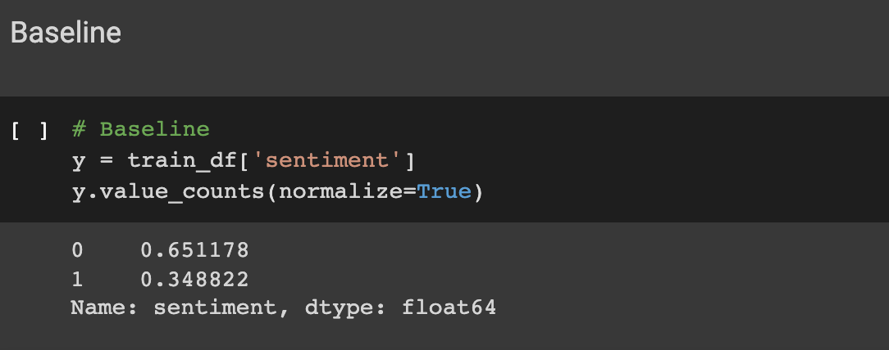
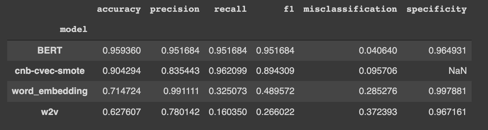

# Capstone Project: Predicting tweet sentiment

## Introduction

The explosion of social media in recent years has provided millions of people with the convenience and avenue to express their opinions and views from anywhere, anytime. With social media being steadily on the rise, the question then begs; how can we then leverage on this growth and make [social monitoring](https://sproutsocial.com/social-listening/) and [social listening](https://business.twitter.com/en/blog/how-to-use-social-listening.html) a key part of social media strategy.  

Social monitoring is the tracking and responding to relevant comments/ feedback sent to the brand. This requires much time and effort to engage and create a real connection with customers and has already been adopted by many companies worldwide as part of their customer service model. This assists in potentially turning a customer's bad experience into a positive one. 

While social monitoring puts the companies at the ground level by engaging directly with their customers, social listening on the other hand takes it a step further and is about understanding the bigger picture. This is done by looking at the monitoring done with a birds' eye view and then analyzing the data. The adoption of this strategy has been steadily on the rise given the fact that more customers are turning to social media to air their opinions and grievances. 

[Twitter](https://en.wikipedia.org/wiki/Twitter) for example, is one social media platform in which users can post and interact with messages known as 'tweets'. Even though only registered users can post, like or retweet tweets, non-registered users are still able to access and read tweets that are set to be publicly available. On Twitter, tweets also include sentiments which refers to emotions, feelings, attitude or opinion. 

[Sentiment analysis](https://ijcset.net/docs/Volumes/volume7issue9/ijcset2017070901.pdf) is the study of emotions and opinions generated from the corresponding text. Basically, the idea is to analyze the tweets together with its corresponding sentiments and then use it to train a model which can be used to predict sentiments from new tweets. 

While tweets are generally shorter than blog posts/new articles which makes it a good for a starter project like this, tweets can also be tricky to deal with as it contains slang words, misspellings, emojis and repeated characters (eg. RT). 

For this project, we will look at tweets related to Apple (@Apple, #AAPL etc.) and present the results of machine learning and deep learning algorithms through the classification of the sentiment of tweets under supervision with the help of preprocessing steps needed in order to achieve high precision of predictions. 

## Executive summary

For this project, I downloaded two datasets containing tweets relating to the company Apple with one dataset being used as the [training](https://data.world/crowdflower/apple-twitter-sentiment) set and the other used as a [testing](https://www.kaggle.com/kerneler/starter-apple-twitter-sentiment-texts-b9dd711b-8/data) set. 

Both datasets consists of Apple related tweets (@apple, #AAPL etc.) as well as the corresponding sentiment on whether it was positive, neutral or negative. Part of the data processing done was to convert it from multiclass to binary. This is because it was decided that it would be more efficient to only focus on two classes, `negative` and `non-negative` tweets. The reason being, from a business standpoint, while it is good to know which areas you currently excel in, it would instead be more beneficial to know which areas are lacking. As the issue is identified, it then allows the business to be able to address the issue and potentially avoid similar issues in the future. 

In addition to the conversion to binary datasets, other basic data cleaning and pre-processing were also done. Including using a [tweet processor library](https://pypi.org/project/tweet-preprocessor/) which makes it very easy to clean tweets. 

After cleaning and processing the data, different models were trained and tested for comparison to determine which is the best performing model. 
To have something to compare our models against, we can use the normalized value of y which is the percentage of y within our target. This represents the simplest model we can use, where assigning a post randomly will give us a 65% chance of classifying it as a non-negative tweet. This will serve as a baseline for our model evaluation. This also shows that our model is imbalanced. 

For the machine learning models, I used two different ways to deal with the class imbalance by either using SMOTE or assigning class weights. I tested both methods and compared the results. As this is a classification problem, the following models were trained and tested:

- Logistic Regression
- Complement Naive Bayes classifier
- K Nearest Neighbor

Note: The Complement Naive Bayes classifier was designed to correct the “severe assumptions” made by the standard Multinomial Naive Bayes classifier. It is particularly suited for imbalanced data sets.

Deep learning has demonstrated superior performance on a wide variety of tasks including NLP, Computer Vision, and Games. As the traditional machine learning methods did not seem to yield results that were good enough and hence I have included three more models based on Deep Learning, in an attempt to create an improved Sentiment Classifier. 
The following models were trained and tested:

- Word embeddings using GRU 
- Gensim implementation of Word2Vec
- BERT

A comparison between the models was done with the results shown below:

|Model|Accuracy|Precision|Recall|F1 Score|Misclassification|Specificity|
|---|---|---|---|---|---|---|
|BERT|0.959|0.952|0.952|0.952|0.041|0.965|
|Complement Naive Bayes with CountVectorizer - smoted|0.904|0.835|0.962|0.894|0.096|-|
|GRU Word embedding|0.715|0.991|0.325|0.490|0.285|0.998|
|Word2Vec|0.628|0.780|0.160|0.266|0.372|0.967|

Based on the table above, the top performing model was the BERT model which had superior scores in almost all categories only losing out very slightly in recall and specificity scores. 

## Model Limitations

As seen above, we can see that BERT model struggles slightly with identifying the overall tone of tweets that have both positive and negative tones with the model showing a slight tendency to predict the tweet as negative rather than positive. This is seen in the slightly lower score in specificity (true negative rate) as compared to sensitivity (true positive rate). However, I would also note that the scores are all well above 95% and this indicates that the model has generally done well in predicting the sentiment of tweets in general with a few minor exceptions and is a good model overall. 

## Final Thoughts

Doing an analysis on Twitter posts is only the tip of the iceberg as this project merely represents an attempt at social media analytics which can help companies know their customers opinions. 
As we go further indepth in social media analytics, we will realise that social listening is not only limited to social media platforms but can be applied to any website with a comments/review/feedback section (eg. new articles). 
In this day and age where anyone can post what they think anywhere anytime, it is definitely of utmost importance to be on the ball with social listening and then addressing any potential issues by nipping it in the bud before it aggravates. As the saying goes, prevention is always better than cure.

