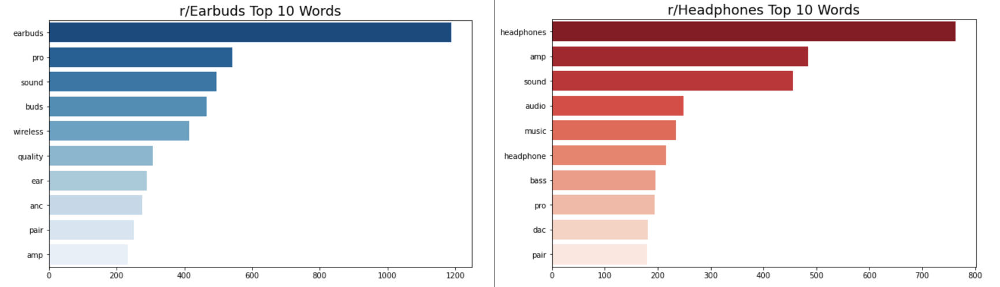
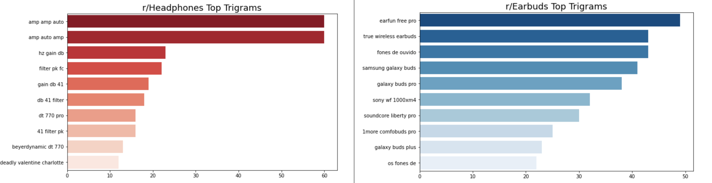

# Project 3: Web APIs & NLP

-----

## Problem Statement
-----
A start-up selling audio equipment wishes to create a website that includes a chatbot that can help direct customers to the items closest to what they are looking for. However, they are unsure of how to do the classification and has outsourced this to us to create a machine learning model which can identify keywords used with specific audio equipment to better filter choices for more likely purchases and also for potential upselling or related equipment items. 

## Introduction:

In order to address the problem issued, a preliminary goal was created to use Reddit posts to do a preliminary classification model. 

Reddit is a collection of interest-based communities known as subreddits, with content that covers almost anything you can imagine. Within each subreddit, users can create text or image posts, and upvote or downvote posts to express approval or disapproval regarding the content of the post. The number of upvotes and downvotes are fed into a hot-ranking algorithm to determine a score for the post, with higher scoring posts rising to the top of the subreddit.

The goal of this project is simple -- to classify posts from two different subreddits based on their `title` and `selftext`, or text within the body of the post. 

For this project, I selected two subreddits that are within the same main category scope but are different topics -- `r/Earbuds` and `r/Headphones`. Both subreddits are relating to audio equipment but of different types and the aim is to extract out keywords/tokens with the main aim of using those tokens to classify whether the author is referring to the Earbuds subreddit or the Headphones subreddit.   

-----
###  Datasets:
-----
To get the necessary posts for this project, I scrapped 1000 'hot' or popular posts from each subreddit ([`r/Earbuds`](https://www.reddit.com/r/Earbuds/) and [`r/Headphones`](https://www.reddit.com/r/headphones/) using the Reddit's [Pushshift API](https://github.com/pushshift/api) which gives access to each subreddit's `.JSON`.

-----
### Cleaning, Preprocessing and EDA
-----
Firstly, I did a quick analysis on the distribution of the type of posts in each subreddit and found that there were a number of posts in `r/Headphones` that were image posts. However, as the `title` and `selftext` would be combined later on, this should not pose much of an issue. 

A quick analysis of the title lengths and post lengths was also done and it was noted that `r/Earbuds` generally has slightly shorter title and posts lengths than `r/Headphones`. 

As the text we just gathered is unstructured data, we need to make sure that our text is clean and free of null values. This also entails removing HTML links and non-alphanumerical characters that won't be useful in a classification model.

A few functions were created. Firstly, a function was created to remove unnecessary columns leaving only the `subreddit`, `title` and `selftext` columns. Those empty `selftext` columns were filled with the `title` under a new column `post` and the rest were added in by joining the `title` and `selftext` columns. 

Next, a function was created to remove HTML links, remove characters that are not letters, lower cases all the words, split them up into individual tokens without officially tokenizing, remove the stopwords. I tried both lemmatization and stemming the words but ended up commenting out the stemmer because I decided on using the lemmatizer.

Lastly, for the analysis of n-grams, a function was also created to get the top n-grams from the two topics. `CountVectorizer` was used here.

Note:
* anc = active noise cancellation
* amp = amplifier
* dac = digital to analogue converter

The main takeaway from this is that n-grams relating to r/Earbuds generally relate to earbuds models/brands. For example, when looking at the top 10 trigrams for r/Earbuds, 8 out of 10 trigrams were earbud models/brands. On the other hand, n-grams relating to r/Headphones have a wider range of audio terminology which includes model/brands and other equipment (amplifiers or filters).

One interesting thing to note here is that there are two trigrams (`fones de ouvido` and `os fones de`) which are in Portugese but a quick google search shows that these two trigrams can translate to either 'headphones' or 'earbuds'. It seems that in Portugese, there is no separate word for the two terms and its meaning can only be interpreted from the context in which its being used. 

It was also interesting to note that the 10th trigram on the list is a song title "Deadly Valentine" by Charlotte Gainsbourg. a quick search shows that it seems like people have been using her song to test the audio quality of the headphones. 

Mapping was also done to change `subreddit` to 0 for `Earbuds` and 1 for `Headphones` and the column was renamed to `is_headphones`:

`r/Earbuds`: `is_headphones` = 0

`r/Headphones`: `is_headphones` = 1

The new dataframe was then saved and exported. 

-----
## Model Selecting & Fine Tuning
-----

The next step that we'll cover below is selecting and tuning a model that can help predict where each post comes from. This is, in effect, a **binary classification** problem. To find the best model to use here, we'll carry out the following steps:

1. Run a Train-Test-Split on our data
2. Transform data using a vectorizer
3. Fit model to training data
4. Generate predictions using test data
5. Evaluate model based on various evaluation metrics (accuracy, precision, recall, ROC-AUC).
6. Select the best model and tune hyper-parameters

Besides `CountVectorizer()`, we'll also be using `TfidfVectorizer()`. `TfidfVectorizer()` is pretty similar to `CountVectorizer()`, except that it looks at the frequency of words in our data. This means that it downweights words that appear in many posts, while upweighting the rarer words.

We'll look to test a range of classification techniques including:
- Logistic Regression
- Random Forest 
- Boosting (Adaptive and Gradient) 
- Multinomial Naive Bayes classification  
- Support Vector Machine (SVM) classification.

Accuracy and F-score will be our main metrics here, given that we're not too particularly concerned about minimizing either false negatives and false positives due to the nature of the topics -- ideally we'd like to minimize both as far as possible.

### Baseline

To have something to compare our model against, we can use the normalized value of y which is the percentage of y within our target. This represents the simplest model we can use, where assigning a post randomly will give us a 50% chance of classifying it correctly. This also shows that our model is balanced. 

### Model Preparation

Here, I instantiated a range of different vectorizers and models. To simplify my workflow slightly, I opted to create a function that utilises Sklearn's Pipeline tool that allows for easy fitting and transformation of data.

From the preliminary model evaluation, we can see that both our logistic regression and naive bayes models did particularly well, with our support vector machine classifier topping the list in terms of both accuracy and AUC-ROC score: 

|    | model   | vectorizer   | train |  test |   roc |precision |recall |f_score |
|---:|:--------|:-------------|------:|------:|------:|---------:|------:|-------:|
|  0 | svc     | tvec         | 0.993 | 0.915 | 0.915 |    0.898 | 0.936 |  0.917 |
|  1 | lr      | tvec         | 0.954 | 0.911 | 0.911 |    0.888 | 0.939 |  0.913 |
|  2 | nb      | cvec         | 0.951 | 0.909 | 0.909 |    0.944 | 0.870 |  0.905 |
|  3 | rf      | cvec         | 1.000 | 0.894 | 0.894 |    0.874 | 0.921 |  0.897 |
|  4 | lr      | cvec         | 0.995 | 0.888 | 0.888 |    0.860 | 0.927 |  0.892 |
|  5 | gb      | cvec         | 0.925 | 0.886 | 0.886 |    0.838 | 0.958 |  0.894 |

Next, the various combinations of models and vectorizers were run and the hyperparameters were fine tuned using `GrisSearchCV`.

Final model results (after fine tuning):

|    | model   | vectorizer   | train |  test |   roc |precision |recall |f_score |
|---:|:--------|:-------------|------:|------:|------:|---------:|------:|-------:|
|  0 | lr      | tvec         | 0.930 | 0.914 | 0.914 |    0.887 | 0.948 |  0.917 |
|  1 | nb      | cvec         | 0.941 | 0.905 | 0.905 |    0.938 | 0.867 |  0.901 |
|  2 | svc     | tvec         | 0.969 | 0.902 | 0.902 |    0.882 | 0.927 |  0.904 |
|  3 | lr      | cvec         | 0.963 | 0.886 | 0.886 |    0.844 | 0.948 |  0.893 |

We can see in the table above that `LogisticRegression` with `TfidfVectorizer` returned the highest R2 accuracy -- in short, our model is able accurately predict 91.3% of the test data based on our text features. The model also has the best AUC-ROC score. We can interpret this metric as proof that that this model is the best at distinguishing between classes. The model does particularly very well in terms of recall, with only 17 false negatives (predicted `r/Earbuds` but actually `r/Headphones` posts).

While the `Multinomial Naive Bayes` model with `CountVectorizer` is better at minimizing false positives (predicted `r/Headphones` but actually `r/Earbuds` posts) with 19 false positives noted. The `LogisticRegression` model with `TfidfVectorizer` still wins overall in terms of test accuracy and f-score.

-----
### Final Model Selected:
-----

- `LogisticRegression` with Ridge regularization (alpha = 0.1 | C = 10)
- Uses `TfidfVectorization` with no max feature limit
- Includes only words or n-grams that appear in at least 3 posts
- Excludes stop words and ignores terms that that appear in more than 40% of posts

Our model is still slightly overfitted as indicated by the slight gap between training and test scores but with limited time and resources, this seems to be the best our model can do. 

